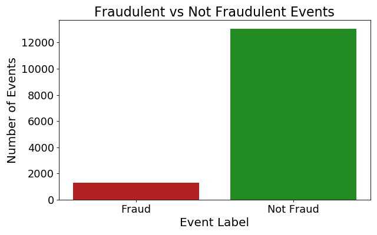
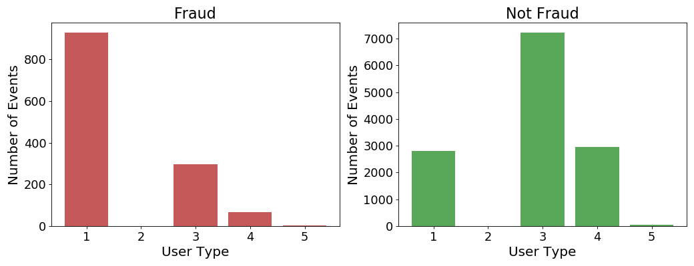
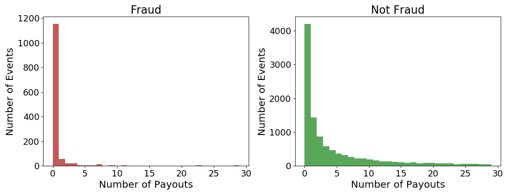
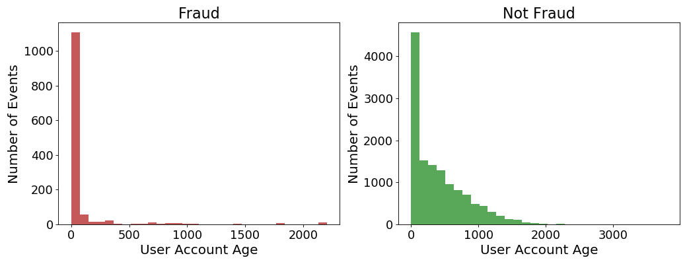
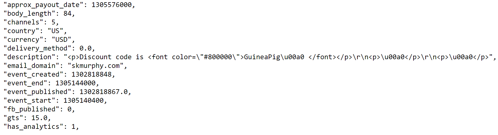
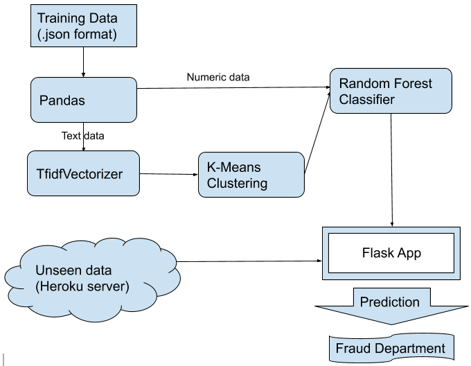
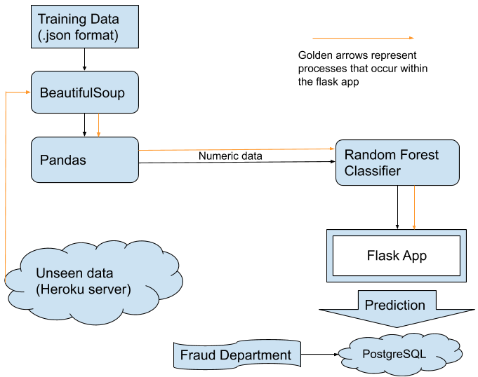
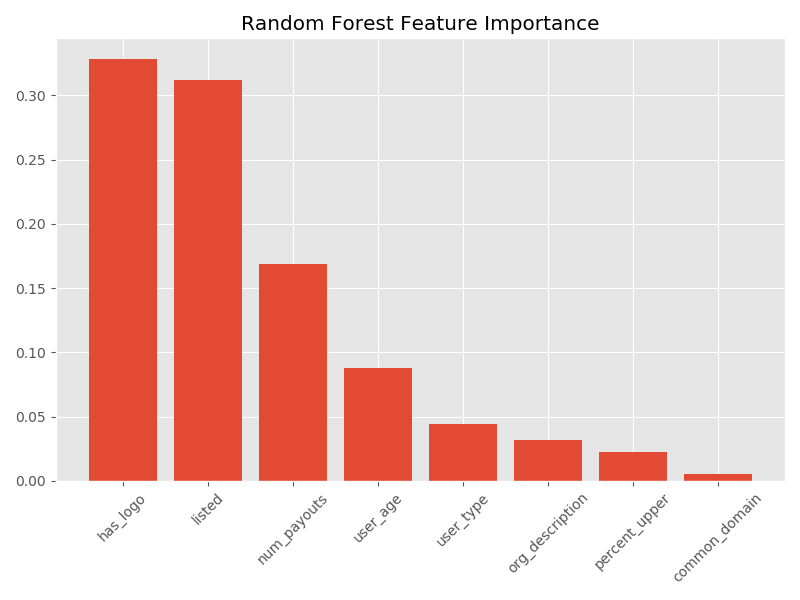

# Fraud Case Study

By Annie Rumbles, Allison Zhou, Marc Russell, and Austin Zimmerman

- [Problem Statement](#problem-statement)
- [Data](#data)
    - [Training Data](#training-data)
    - [EDA](#eda)
       - [Class Imbalance](#class-imbalance) 
    - [Test Data](#test-data)
- [Pipeline](#pipeline)
- [Model Selection and Improvement](#model-selection-and-improvement)
    - [Dealing With Class Imbalance](#dealing-with-class-imbalance)
    - [Logistic Regression](#logistic-regression)
    - [Random Forest](#random-forest)
    - [Results](#results)
- [Flask Implementation](#flask-implementation-no-longer-active)
- [Future Work](#future-work)
- [Citation](#citation)

       

## Problem Statement

We have been tasked with identifying fraudulent events based on data provided to us by an online event planning company.  Since our product will be identifying potential fraud for further investigation, as opposed to automatically taking down 'fraud' events, we expect that the best approach will be to minimize false negatives.  The business is better suited by a product that is overly cautious in its initial screen, allowing the human agents to make final decision based on their experience or, perhaps less often, contact with the customer.

## Data
### Training Data
       
The training data came in json format, with 14,337 rows and 44 features.  The features contained a lot of information, but not all of it appeared to be helpful in identifying fraud.  We removed data that had been collected over time since each event's publication (such as ticket sales), as our goal was to use only information immediately available.

### EDA
#### Class Imbalance

       
       
9% of the data was flagged as fraudulent, this imbalance can be seen above. 

-----------

       
       
There seemed to be an emphasis on user type 1 for events flagged as fraudulent.

-----

       
       
----

       

The plots above show a similar pattern but for two different features, the fraud class has a much smaller, almost non-existent, tail in both.

Besides the above data that came directly from the training dataset, we also attempted to come up with additional engineered features.  Specifically there are three: 
* Percent upper-case:  For this, we first used Beautiful soup to extract the text only, then conducted the normal cleaning process of removing punctuation and stop words as well as lemmatizing the tokens.  Conspicuously missing from this process is the standard lower-casing of all letters.  We made this choice because we felt that the percentage of a string that is written in upper case letters might contain valuable signal.  We calculated this percentage for each event name and description (as one corpus) and added it to our modeling environment. 

* Common email domain:  We made an assumption that fraudsters are more likely to use uncommon email domains when trying to game the system.  After studying the data, we narrowed down the common emails to be six: gmail, yahooo, live, me, hotmail, and aol.  Country variations of these email domains are accounted for. We classified the email domain for each row of data as either common or uncommon (in practice, `True` or `False`).

* Presence of an organization description: We altered org_description so that it simply indicated the existence of an organization description, figuring that a lack of description might be more likely for fraudulent events.

In the end, we stuck with 8 features that appeared to be important to predicting fraudulent events:

`['has_logo', 'listed', 'num_payouts', 'user_age', 'user_type', 'org_description', 'percent_upper', 'common_domain']`
 

### Test Data
The test data is hosted on a heroku server that randomly selects an unlabeled data point at an interval between 10 and 60 seconds.

## Pipeline

New events were accessed using a straight-forward private API provided by Galvanize. To gather and bring data from the API into python we used the **Requests** library. Using the GET method allowed us to *refresh* the webpage to send the latest entry into the pipeline.

Our previous EDA on historical data allowed us to selectively pull relevant data from the new entries - reducing the amount of work. To achieve this we used the **BeautifulSoup** library. This provided us with a way to easily navigate, search, and modify our JSON text string.

By cleverly splitting the JSON text on certain html tags we were able to consistently seperate relevant data entries. We managed the incoming data using a **Pandas** dataframe for easy manipulation. 

After cleaning and organizing the event-features, we wanted to store our data on a **PostgreSQL** database using the **psycopg2** python adapter. This would've allowed our fraud team to remotely access a large-scale, fraud-flagged events.

At first, we hoped to apply NLP and K-Means clustering to the event name and description fields, but for reasons that become clear in later sections, these processes did not make it into our final model.

Once the pickled model was incorporated into the flask app, we ran the test data through a very similar cleaning process contained within the app and then predicted if it was fraud or not.

<table>
<tr><th>First Iteration</th><th>Final Iteration</th></tr>
<tr><td>

       

</td><td>

       

</td></tr> </table>

# Model Selection and Improvement

## Dealing with Class Imbalance

It is important to note that the classes in this dataset were severely imbalanced, only about 9% of the rows were members of the positive class. In order to address the heavy class imbalance in our dataset, we chose to oversample items that belonged to the 'fraud' class.  This had the effect of substantially improving our model performance and made the precision-recall tradeoff not quite as steep as we originally feared.  We took advantage of the built-in functionality of python's `imblearn` module to accomplish this.

Another strategy we considered to address this issue include stratifying the train-test-split and use class_weights = 'balanced' (RandomForest hyperparameter) in the modeling process.  But this approach yielded poor results when compared with oversampling. 

## Logistic Regression

Literature on the subject indicated that a standard Logistic Regression might perform well in this scenario.  We ran this model with standard hyperparameters and got the following results as a baseline:

| Scoring Metric | Test Score |
|----------------|-------------|
| Accuracy       | 0.81        |
| Recall         | 0.85        |
| F1-score       | 0.82        |

We also wanted to give a non-linear model a shot, so we put together a Random Forest.  

## Random Forest

We chose a threshold value of 0.3 in order to maximize recall, while still retaining acceptable performance in accuracy and precision

| Scoring Metric | Train Score | Test Score |
|----------------|-------------|------------|
| Accuracy       | 0.884        | 0.879       |
| Recall         | 0.989        | 0.989       |
| F1-score       | 0.879        | 0.877       |
| Precision      | 0.790        | 0.788       |

Trying to get a sense of what factors weigh heavily on fraud:

       

## Results

After doing the NLP and KMeans clustering on the term frequency-inverse document frequency vector and comparing the model with clusters and without those clusters, we found that the clusters didn't contribute significantly to the model so we opted for a model that predicted using the following features: 

`['has_logo', 'listed', 'num_payouts', 'user_age', 'user_type', 'org_description', 'common_domain', 'percent_upper']`

## Flask Implementation (No longer active)

We created a simple flask app, hosted on an Amazon EC2 instance, where new data coming off of the Heroku server (as well as our model's predictions) can be viewed in real time if need be.  

## Future Work

For future improvements to the model, we'd like to achieve full integration with the PostgreSQL server in order to maintain a database of flagged events.

## Citations

Header image credit: https://paymentdepot.com/wp-content/uploads/2018/12/5-Types-of-Retail-Fraud-and-How-to-Prevent-Them1-1024x683.jpg

Johan Perols; Financial Statement Fraud Detection: An Analysis of Statistical and Machine Learning Algorithms. AUDITING: A Journal of Practice 1 May 2011; 30 (2): 19–50. doi: https://doi.org/10.2308/ajpt-50009