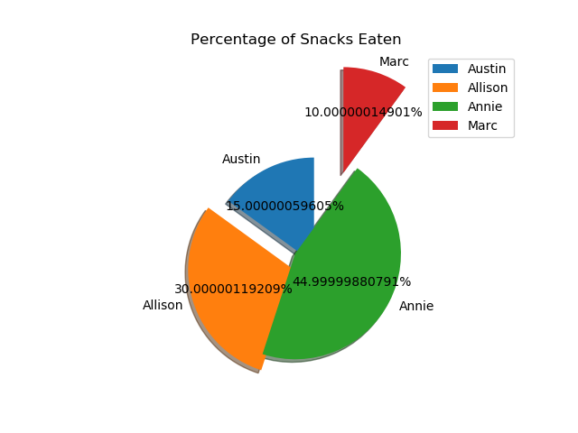

# Fraud Case Study

By Annie Rumbles, Allison Zhou, Marc Russell, and Austin Zimmerman

- [Problem Statement](##Problem-Statement)
- [Data](##Data)
    - [Training Data](##Training-Data)
    - [EDA](##EDA)
    - [Test Data](##Test-Data)
- [Pipeline](##Pipeline)
- [Model Selection and Improvement](#Model-Selection-and-Improvement)
    - [Logistic Regression](##Logistic-Regression)
    - [Random Forest](##Random-Forest)
    - [Results](##Results)
- [Flask Implementation](##Flask-Implementation)
- [Future Work](#Future-work)

       

## Problem Statement

We have been tasked with identifying fraudulent events based on data provided to us by an online event planning company.  Since our product will be identifying potential fraud for further investigation, as opposed to automatically taking down 'fraud' events, we expect that the best approach will be to minimize false negatives.  The business is better suited by a product that is overly cautious in its initial screen, allowing the human agents to make final decision based on their experience or, perhaps less often, contact with the customer.

## Data
### Training Data
       
The training data came in json format, with 14,337 rows and 44 features.  The features contained a lot of information, but not all of it appeared to be helpful in identifying fraud.  We removed data that had been collected over time since each event's publication (such as ticket sales), as our goal was to use only information immediately available.

### EDA
#### Class Imbalance

       
       
9% of the data was flagged as fraudulent, this imbalance can be seen above. 

-----------

       
       
There seemed to be an emphasis on user type 1 for events flagged as fraudulent.

-----

       
       
----

       

The plots above show a similar pattern but for two different features, the fraud class has a much smaller, almost non-existent, tail in both.

Some cursory EDA revealed that many of the features were simply not relevant to the occurrence of fraud, i.e. they occurred at the same rate or with similar values across fraud and non-fraud events.

In the end, we stuck with 8 features that appeared to be important to predicting fraudulent events:

`['has_logo', 'listed', 'num_payouts', 'user_age', 'user_type', 'org_description', 'name', 'event_description']`
 
We altered org_description so that it simply indicated the existence of an organization description, figuring that a lack of description might be more likely for fraudulent events.  The rest of the features were analyzed as is.

It is important to note that the classes in this dataset were severely imbalanced, only about 9% of the rows were members of the positive class. Our first step towards mitigating the effects of this was stratifying the train_test_split.  Additional steps are discussed below in the model selection section.

### Test Data
The test data is hosted on a heroku server that randomly selects an unlabeled data point at an interval between 10 and 60 seconds.

## Pipeline

New events were accessed using a straight-forward private API provided by Galvanize. To gather and bring data from the API into python we used the **Requests** library. Using the GET method allowed us to *refresh* the webpage to send the latest entry into the pipeline.

Our previous EDA on historical data allowed us to selectively pull relevant data from the new entries - reducing the amount of work. To achieve this we used the **BeautifulSoup** library. This provided us with a way to easily navigate, search, and modify our JSON text string.

By cleverly splitting the JSON text on certain html tags we were able to consistently seperate relevant data entries. We managed the incoming data using a **Pandas** dataframe for easy manipulation. 

After cleaning and organizing the event-features, we wanted to store our data on a **PostgreSQL** database using the **psycopg2** python adapter. This would've allowed our fraud team to remotely access a large-scale, fraud-flagged events.

At first, we hoped to apply NLP and K-Means clustering to the event name and description fields, but for reasons that become clear in later sections, these processes did not make it into our final model.

Once the pickled model was incorporated into the flask app, we ran the test data through a very similar cleaning process contained within the app and then predicted if it was fraud or not.

<table>
<tr><th>First Iteration</th><th>Final Iteration</th></tr>
<tr><td>

       

</td><td>

       

</td></tr> </table>

# Model Selection and Improvement

Literature on the subject indicated that a standard Logistic Regression might perform well in this scenario.  We ran this model with standard hyperparameters and got the following results as a baseline:
## Logistic Regression
#### 500 Sample Subset - with NLP & KMeans Clusters

| Scoring Metric | Train Score |
|----------------|-------------|
| Accuracy       | 0.92        |
| Recall         | 0.30        |
| F1-score       | 0.42        |

Given the large class imbalance, this high-accuracy, poor-recall model is not all that much of a shock.
We made one small change to this model that made a hug difference, setting the class_weights parameter to 'balanced'.

<table>
<tr><th>NLP & KMeans Clusters</th><th>No NLP or KMeans Clusters</th></tr>
<tr><td>

 
| Scoring Metric | Train Score | Test Score |
|----------------|-------------|------------|
| Accuracy       | 0.78        | 0.78       |
| Recall         | 0.85        | 0.84       |
| F1-score       | 0.41        | 0.40       |
| Precision      | 0.27        | 0.27       |

</td><td>

| Scoring Metric | Train Score | Test Score |
|----------------|-------------|------------|
| Accuracy       | 0.78        | 0.79       |
| Recall         | 0.83        | 0.82       |
| F1-score       | 0.41        | 0.42       |
| Precision      | 0.27        | 0.28       |

</td></tr> </table>

We also wanted to give a non-linear model a shot, so we put together a Random Forest.  

## Random Forest

<table>
<tr><th>NLP & KMeans Clusters </th><th>No NLP or KMeans Clusters</th></tr>
<tr><td>

| Scoring Metric | Train Score | Test Score |
|----------------|-------------|------------|
| Accuracy       | 0.83        | 0.79       |
| Recall         | 0.92        | 0.88       |
| F1-score       | 0.50        | 0.49       |
| Precision      | 0.34        | 0.34       |

</td><td>

| Scoring Metric | Train Score | Test Score |
|----------------|-------------|------------|
| Accuracy       | 0.83        | 0.79       |
| Recall         | 0.91        | 0.87       |
| F1-score       | 0.50        | 0.50       |
| Precision      | 0.34        | 0.34       |

</td></tr> </table>

Trying to get a sense of what factors weigh heavily on fraud:

       

## Results

After doing the NLP and KMeans clustering on the term frequency-inverse document frequency vector and comparing the model with clusters and without those clusters, we found that the clusters didn't contribute significantly to the model so we opted for a model that predicted using the following features: 

`['has_logo', 'listed', 'num_payouts', 'user_age', 'user_type', 'org_description']`

       

## Flask Implementation

We created a simple [flask app](http://3.16.163.155:8808/), hosted on an Amazon EC2 instance, where new data coming off of the Heroku server (as well as our model's predictions) can be [viewed](http://3.16.163.155:8808/) in real time.  The app takes this data and uploads it to a PostgreSQL server, also hosted on AWS, which can be queried by the company's fraud invesigators.

## Future Work

For future improvements to the model, we would like to implement another class weighting technique by either oversampling, undersampling, or SMOTE. We'd also like to compare the performance of a gradient boosted classifier to our random forest.

Integration with the PostgreSQL server in order to maintain a database of flagged events.

# #Analysis

    

## Citations

Header image credit: https://paymentdepot.com/wp-content/uploads/2018/12/5-Types-of-Retail-Fraud-and-How-to-Prevent-Them1-1024x683.jpg

Johan Perols; Financial Statement Fraud Detection: An Analysis of Statistical and Machine Learning Algorithms. AUDITING: A Journal of Practice 1 May 2011; 30 (2): 19–50. doi: https://doi.org/10.2308/ajpt-50009